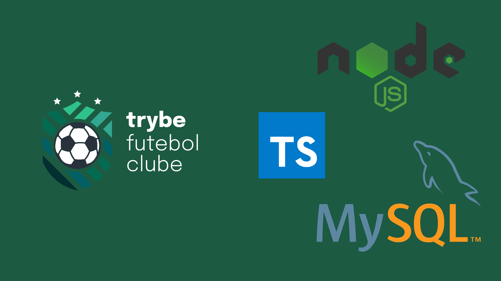

# ⚽ Trybe Futebol Clube



## 📡 Objetivo

Essa aplicação tem como objetivo ser um site informativo sobre partidas e classificações de futebol. Você pode consultar como está o andamento de partidas, se estiver logado pode adicionar ou editar uma partida.

<br />

## ⚙️ Tecnologias e Ferramentas

<div>
  
  
  
  
  
  
  
  
  
  
  
  
    
  
</div>

<br />

# 🚀 Instalação e execução

<details>
<summary>Instalação e execução com Docker</summary>
<br />

Para rodar está aplicação é necessário ter **Git**, **Docker** e o **Docker Compose** instalados no seu computador. O Docker Compose precisa estar na versão **1.29** ou superior.

Para conseguir executar os comandos do abaixo também é necessário que seu sistema operacional tenha um terminal Bash instalado. Caso você esteja utilizando Linux ou macOS, o Bash já vem instalado por padrão. Porém, se o seu sistema for Windows, você pode [aprender como instalar](https://dicasdeprogramacao.com.br/como-instalar-o-git-no-windows/).

### 1 - Clone o repositório:

```
git clone git@github.com:lauropera/trybe-futebol-clube.git
```

### 2 - Na raíz do projeto, suba os containers do frontend (`app_frontend`), backend (`app_backend`) e o banco de dados (`db`) com o comando:

    npm run compose:up

Os containers estão mapeados nas seguintes portas:

- app_frontend: 3000
- app_backend: 3001
- db: 3002

Para parar os containers, na pasta raiz do projeto execute o comando:

    npm run compose:down

### 3 - Acessando o Frontend

Para acessar o frontend, vá em seu navegador acesse a rota:

    http://localhost:3000

### 4 - Usuários para fazer login

Nessa aplicação é necessário fazer o login com um email e senha. A tabela abaixo disponibiliza usuários pré-cadastrados para o acesso:

| Email             | Senha        |
| ----------------- | ------------ |
| admin@admin.com   | secret_admin |
| user@user.com     | secret_user  |

</details>
<br />

# ☕ Testes

### Para você pode ver a cobertura dos testes utilize os seguintes comandos:

Entre no terminal container do backend

    docker exec -it app_backend sh

Execute o comando para ver a cobertura

    npm run test:coverage

Para poder sair do terminal do container execute o comando dentro do próprio

    exit

<br />

#

<div>
  <p align="center">🍐</p>
</div>
